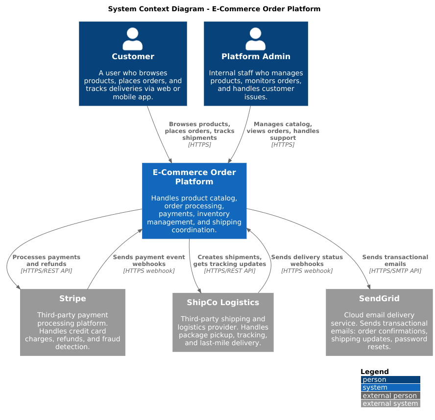
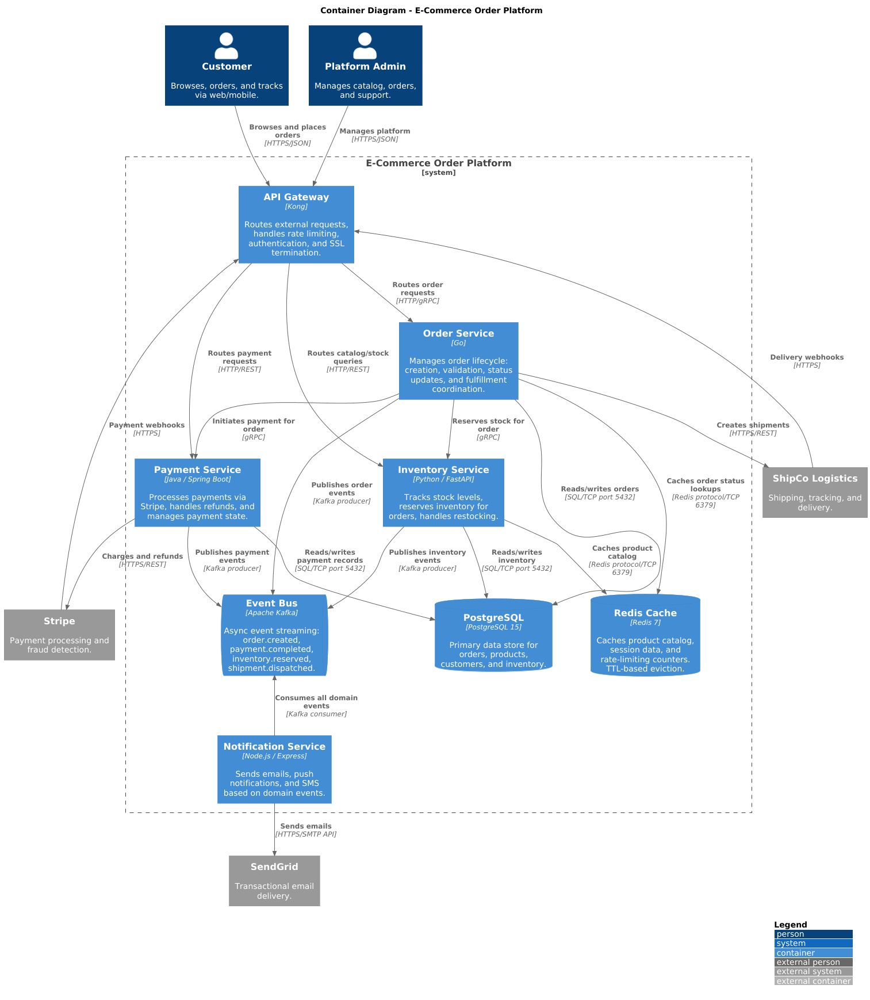
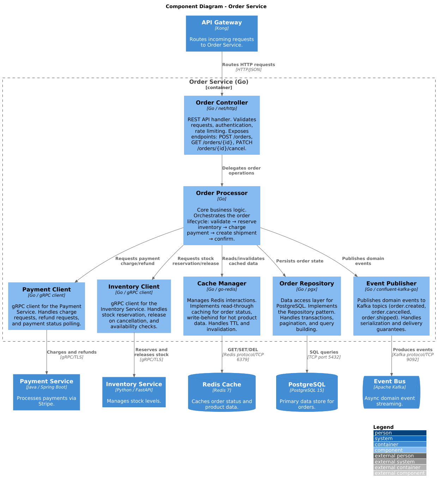
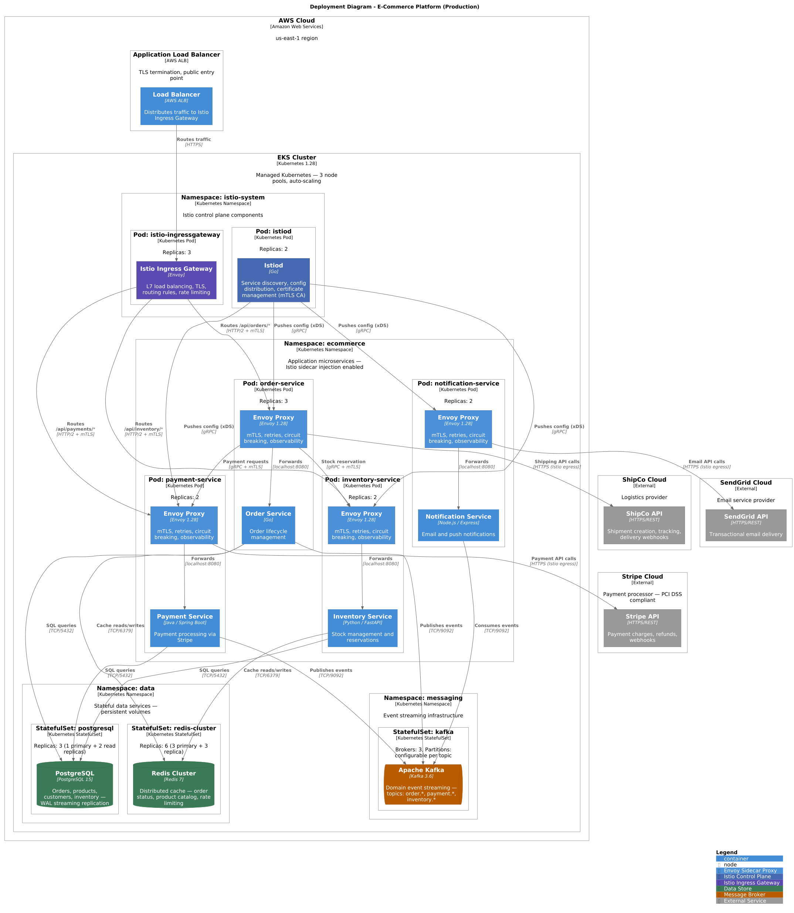

# C4-PlantUML Architecture Template

A portable, reusable C4 model skeleton using [C4-PlantUML](https://github.com/plantuml-stdlib/C4-PlantUML) for documenting software architectures. The example domain is an **E-Commerce Order Processing Platform** with API Gateway, Kubernetes microservices, Istio service mesh, Redis caching, and external integrations.

Clone this repo and replace the domain with your own system.

## Prerequisites

- IntelliJ IDEA with the **PlantUML Integration** plugin installed
- Internet connection (diagrams pull C4 macros from GitHub at render time)

## File Overview

| File | C4 Level | Description |
|------|----------|-------------|
| `c4_1_context.puml` | Level 1 — System Context | Big picture: system as a black box, actors, external systems |
| `c4_2_container.puml` | Level 2 — Container | Zoom in: services, databases, message brokers, API gateway |
| `c4_3_component.puml` | Level 3 — Component | Zoom into one container (Order Service): internal modules |
| `c4_4_code.puml` | Level 4 — Code | Class/interface diagram of the Order domain model |
| `c4_5_deployment.puml` | Deployment | Infrastructure: K8s cluster, Istio mesh, Envoy sidecars, pods |
| `c4_6_dynamic.puml` | Dynamic | Sequence-like flow: order placement interaction across containers |
| `docs/c4-levels-guide.md` | Reference | C4 theory, when to use each level, tips and common mistakes |

## Diagram Previews

### Level 1 — System Context


### Level 2 — Container


### Level 3 — Component


### Level 5 — Deployment


## How to Render

1. Open any `.puml` file in IntelliJ
2. The PlantUML plugin renders a live preview in the side panel
3. Right-click the preview to export as PNG/SVG

## How to Adapt for Your Project

1. **Replace the domain** — Update actors, system names, and descriptions in `c4_1_context.puml`
2. **Adjust containers** — Rename services, databases, and technologies in `c4_2_container.puml`
3. **Pick one container to detail** — Modify `c4_3_component.puml` to zoom into your most complex service
4. **Update deployment** — Change namespaces, pod names, and infrastructure in `c4_5_deployment.puml`
5. **Code level is optional** — Only create `c4_4_code.puml` if your domain model needs explicit documentation

Each `.puml` file has comments marking what to customize.

## C4-PlantUML Library Reference

All diagrams use remote includes from:

```
https://raw.githubusercontent.com/plantuml-stdlib/C4-PlantUML/master/
```

Available includes:
- `C4_Context.puml` — System Context & Landscape diagrams
- `C4_Container.puml` — Container diagrams
- `C4_Component.puml` — Component diagrams
- `C4_Deployment.puml` — Deployment diagrams
- `C4_Dynamic.puml` — Dynamic (sequence-like) diagrams

For the full macro reference, see the [C4-PlantUML README](https://github.com/plantuml-stdlib/C4-PlantUML).

## Architecture Decision Records (ADRs)

Document key architectural decisions in `docs/adr/` using plain Markdown (no special tooling needed). Each ADR captures **why** a decision was made, not just what was chosen.

Suggested template (`docs/adr/000-template.md`):

```
# [short title]

## Status
[Proposed | Accepted | Deprecated | Superseded by ADR-XXX]

## Context
What is the problem or force driving this decision?

## Decision
What did we decide?

## Consequences
What are the tradeoffs? What becomes easier, what becomes harder?
```

Example ADRs for this domain:
- `001-api-gateway-choice.md` — Why Kong over Envoy Gateway or AWS API Gateway
- `002-sync-vs-async-order-flow.md` — Why payment is synchronous but notifications are async via Kafka
- `003-single-postgres-vs-db-per-service.md` — Shared DB tradeoff and path to decomposition
- `004-event-schema-evolution.md` — How Kafka schema changes avoid breaking consumers

> **Why plain Markdown?** ADRs live next to code, are reviewed in PRs, and should be readable without any rendering tool. ASCII + Markdown keeps them portable and diff-friendly.

## Learn More

- [docs/c4-levels-guide.md](docs/c4-levels-guide.md) — C4 model theory and level-by-level reference
- [C4 Model official site](https://c4model.com/)
- [C4-PlantUML GitHub](https://github.com/plantuml-stdlib/C4-PlantUML)
